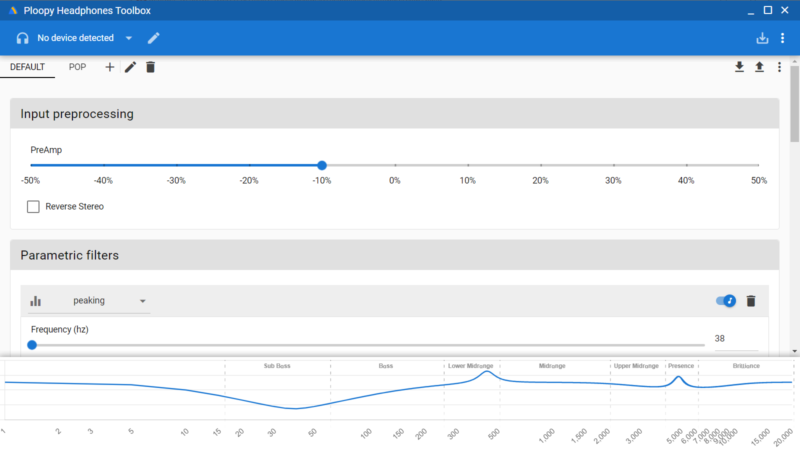
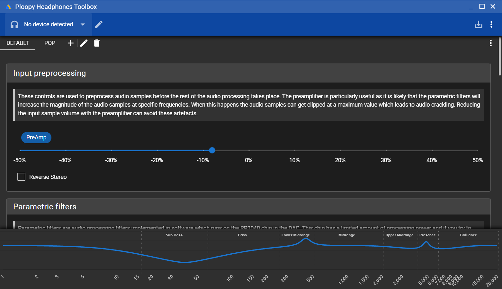

# Ploopy Headphones Toolbox

Ploopy Headphones Toolbox is an application for configuring the filtering applied by the Ploopy Headphones DAC without having to rebuild the firmware.





To use this tool you will need to be running a firmware image build from the [headphones-toolbox branch](https://github.com/george-norton/headphones/tree/headphones-toolbox), prebuilt binaries are available [here](https://github.com/george-norton/headphones/releases/tag/headphones-toolbox-alpha-v1).

## Alpha Test

This is an Alpha test version of Ploopy Headphones Toolbox, it is pretty functional at this point but there are still a few planned bits which are not implemented. Feel free to raise defects, pull requests or leave feedback over on [r/ploopy](https://www.reddit.com/r/ploopy).

## Quickstart guide

Grab a firmware image from [here](https://github.com/george-norton/headphones/releases/tag/headphones-toolbox-alpha-v1) and flash it onto your DAC.
Grab a build of Ploopy Headphones Toolbox from [here](https://github.com/george-norton/headphones-toolbox/releases/tag/headphones-toolbox-alpha-v2) and install it on your PC.

If you are a Linux user you will need to set a udev rule to allow users to access the USB device. As root, run:
```
echo 'SUBSYSTEM=="usb", ATTRS{idVendor}=="2e8a", ATTRS{idProduct}=="fedd", MODE="666"' > /etc/udev/rules.d/100-ploopy-headphones.rules`
udevadm control --reload-rules && udevadm trigger
```

If you are a MacOS user, you may need to `brew install libusb`. The application is not signed so you will see warning messages.

Run the application, it should detect your device. Click the + button to add a configuration, when you modify the filters the frequency response graph and the filters running on the device will change in real time. If you start playing some music, then change the filters you can hear the result instantly. **_WARNING:_ Keep the volume low, and be cautious making changes as filers can cause the sound to become very loud.**
If you come up with a config you like, click the save button in the top right to persist the configuration to flash memory.

You can export your faviourite configurations to JSON files and share them with others.

## Current development status

The application is currently in Alpha status. It is not feature complete, but it does implement quite a bit of useful stuff.

Missing functionality:
- Not many errors are reported to the user.
- Does not report device information to the user (version numbers etc..)
- Does not validate the firmware version (should reject devices with newer than expected firmware)

Implemented functionality:
- Device discovery.
- Microsoft OS descriptor 2.0 support, auto loads the winusb driver so we can configure the device.
- Reboot device into bootloader (on Windows this reqires that you are already running a toolbox firmware).
- Set a new device configuration and listen to the effect in real time.
- Save the configuration to flash.
- Load configs from flash.
- Import/Export configs for sharing.
- Read the configuration back from the device.
- Configure the PCM3060 filters.

Known issues:
- There is a burst of audio noise when when writing a config to flash, this seems to be due to the time it takes to write to flash. I turn the DAC off then back on to mask it, the slight pop sounds much better.

## Developer guide

The application is build using [Tauri](https://tauri.app/), [Quasar](https://quasar.dev/) and a little [Rust](https://www.rust-lang.org/). These were picked for consistency with QMK who are using the same combination for their upcoming xap client application. The user interface itself is build with standard web technologies (vue3, quasar, html. typescript).

To build the application from scratch in developer mode you will need to install nodejs and yarn, then run:
```
yarn install
yarn tauri dev
```
Once started the application will automatically update when you change the code.